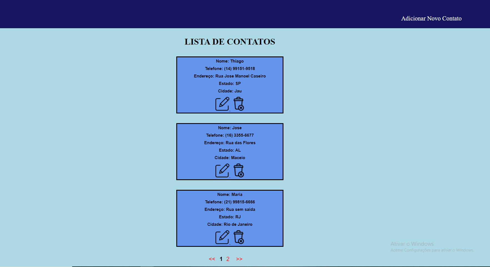
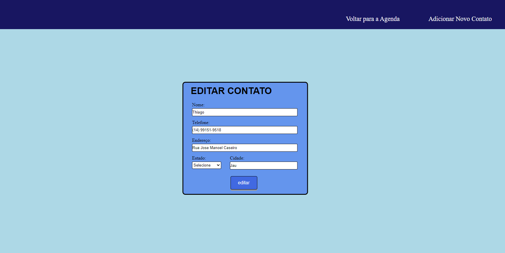
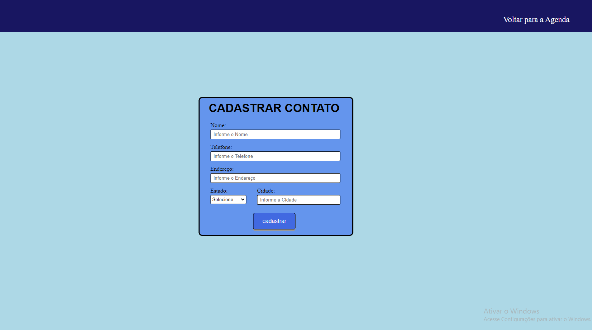

# Agenda Web

### 📕 Projeto de uma agenda de contatos.
Uma agenda simples que permite cadastrar, editar e excluir contatos. Na pagina inicial a agenda exibe uma lista com os contatos cadastrados, onde podem ser excluidos ou editados.



## Pré-Requisitos

* Sistema de banco de dados: MySQL;
* Servidores Locais: WAMPSERVER ou XAMPP.

## Instalação

* Coloque os arquivos em uma pasta;
* Mova a pasta para o diretório do seu servidor.

#### WAMPSERVER:
```
Vá até o diretório onde o WAMPSERVER foi instalado, abra a pasta www e coloque a pasta com os arquivos.
```

#### XAMPP:
```
Vá até o diretório onde o XAMPP foi instalado, abra a pasta htdocs e coloque a pasta com os arquivos.
```

### Banco de dados

* Abra o localhost/phpmyadmin em seu navegador;
* Conecte com o Utilizador: ROOT sem Palavra-passe no servidor MySQL, clique em executar;
* Crie uma base de dados com o nome 'agendajn';
* Vá em importar e selecione o arquivo SQL localizado na pasta 'banco de dados'.

## Exemplo de Uso

Abra o Projeto pelo navegador em: localhost/pasta com os arquivos.

#### EXEMPLO:
```
localhost/agenda
```

A pagina inicial do projeto será aberta, nela estarão 3 contatos pré cadastrados como exemplo.

Cada Pagina mostra apenas 3 contatos. Ao adicionar mais de 3 contatos, mais paginas são criadas.

Você pode navegar por estas paginas pelo botão demonstrado na imagem abaixo:


### EDITAR O CONTATO

 O botão editar é utilizado para atualizar os dados de um contato.

Ao clicar você é redirecionado para uma pagina que contém um formulário com os dados do contato selecionado. 



Nela você pode atualizar os dados do contato, como: Nome, Telefone, Endereço, Estado e Cidade.

Após atualizar os dados clique no botão Editar. Se todos os dados estiverem preenchidos você é redirecionado para a Pagina Inicial, onde os dados do contato já estarão atualizados.

### APAGAR O CONTATO

 O botão apagar é utilizado para excluir todos os dados de um contato.

Ao Clicar todos os dados do contato selecionado serão excluidos da base de dados. O contato excluido é removido da Lista localizada na Pagina Inicial.

### ADICIONAR UM NOVO CONTATO

Na tela inicial clique no botão 'Adicionar Novo Contato'. Você será redirecionado para a pagina de cadastro, como demonstrado na imagem abaixo:



Complete todos os campos do formulário e clique no botão cadastrar para adicionar um novo contato. Ao clicar no botão você é redirecionado para a Pagina Inicial. Caso não tenha digitado todos os campos não será possivel cadastrar o contato. 

Caso não queira cadastrar o contato, o botão Voltar para a Agenda volta a Pagina Inicial.
